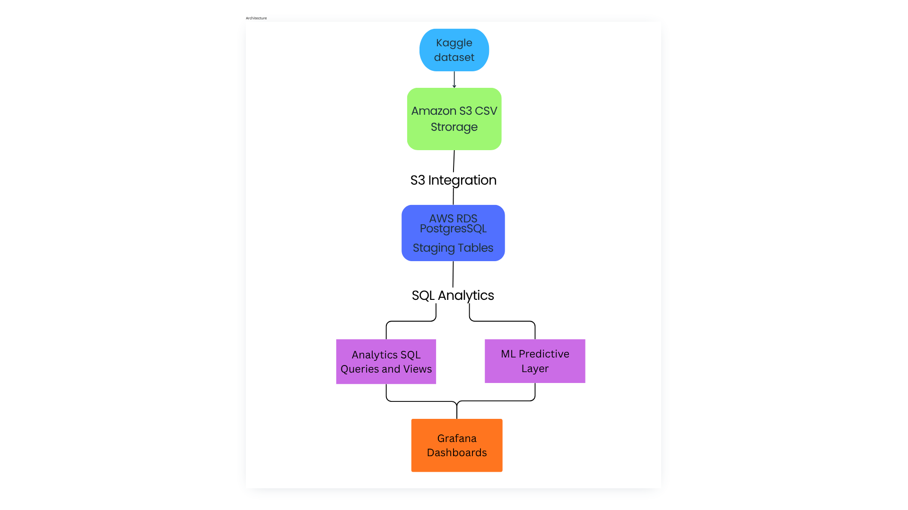
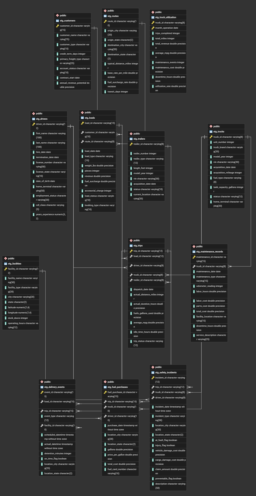
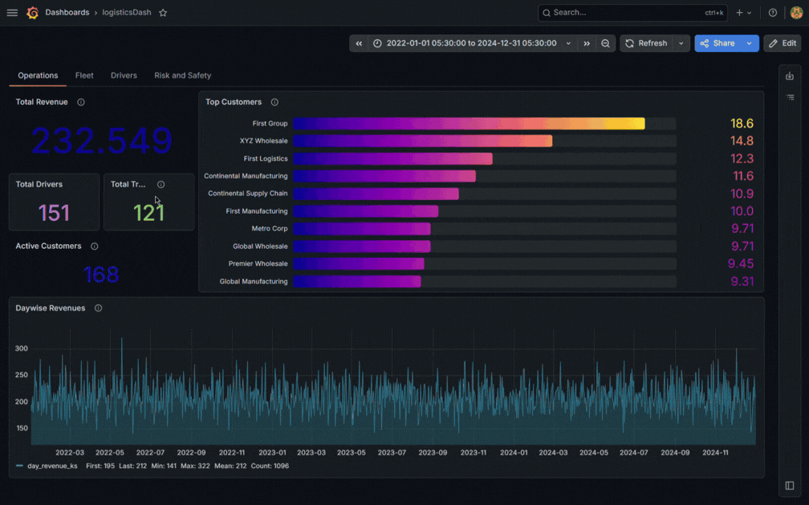

# Cloud Logistics Operations Analytics Platform
End-to-end logistics analytics platform using Amazon S3, AWS RDS PostgreSQL, SQL, Grafana, and machine learning to analyze fleet, driver and operational performance.

### 1. Project Overview
This project develops a cloud-based logistics analytics platform that ingests logistics operations data from Amazon S3 into AWS RDS PostgreSQL, performs data validation and analytical transformations using SQL, and presents operational KPIs through Grafana dashboards. The platform is designed to support fleet, driver, customer, and maintenance performance analysis, with a machine-learning layer for predictive operational insights.

### 2. Business Targets
   - Monitor fleet utilization and performance
   - Analyze driver performance and safety
   - Analyze fuel and maintenance costs
   - Support predictive logistics analytics

### 3. Architecture

### 4. Architecture Components
#### I. Dataset
   The dataset is obtained from <a href="https://www.kaggle.com/datasets/yogape/logistics-operations-database?resource=download">kaggle</a>

Data includes: Drivers, Trucks, Customers, Routes, Loads, Trips, Fuel purchases, Maintenance, Delivery events, Safety incidents, Truck utilization

#### II. AWS S3 and RDS Ingestion
The dataset is ingested in the following order

CSV Files -> Amazon S3 Bucket -> IAM Role -> RDS S3 Integration -> PostgreSQL Staging Tables

#### III. SQL Analytics
This includes Data Quality check:
- Duplicate records
- Missing primary keys
- Null values

Utilizing SQL techniques such as:
- JOINS
- CTEs
- GROUP BY
- VIEWS
to generate data insights

#### IV. Business Insights
- Fleet : Fleet Utilization, Total Miles
- Drivers : Active Drivers, Trips per Driver
- Customers : Revenue, Contributions
- Safety : Incidents, Damages

### 5. Grafana Dashboards

