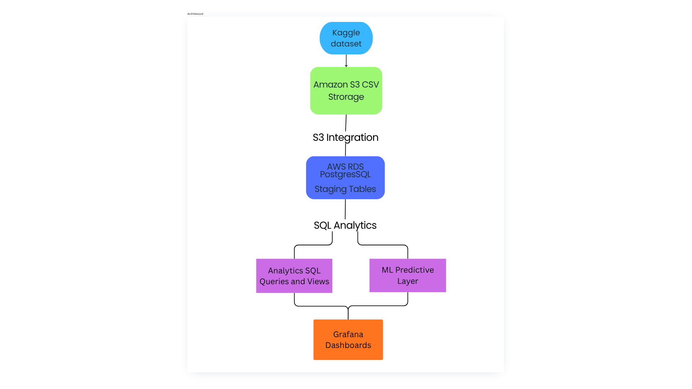
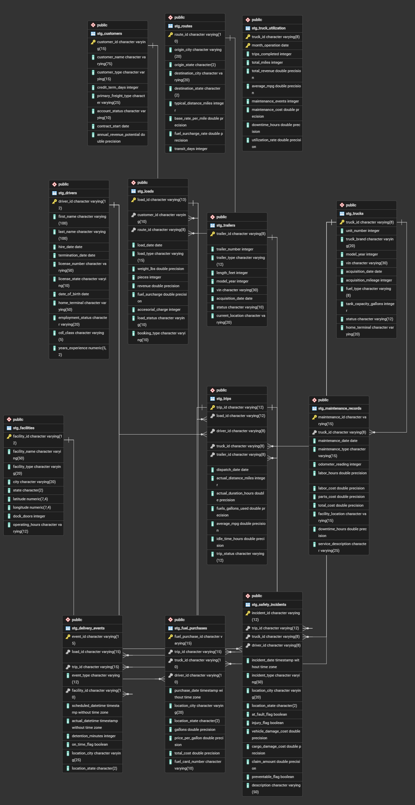
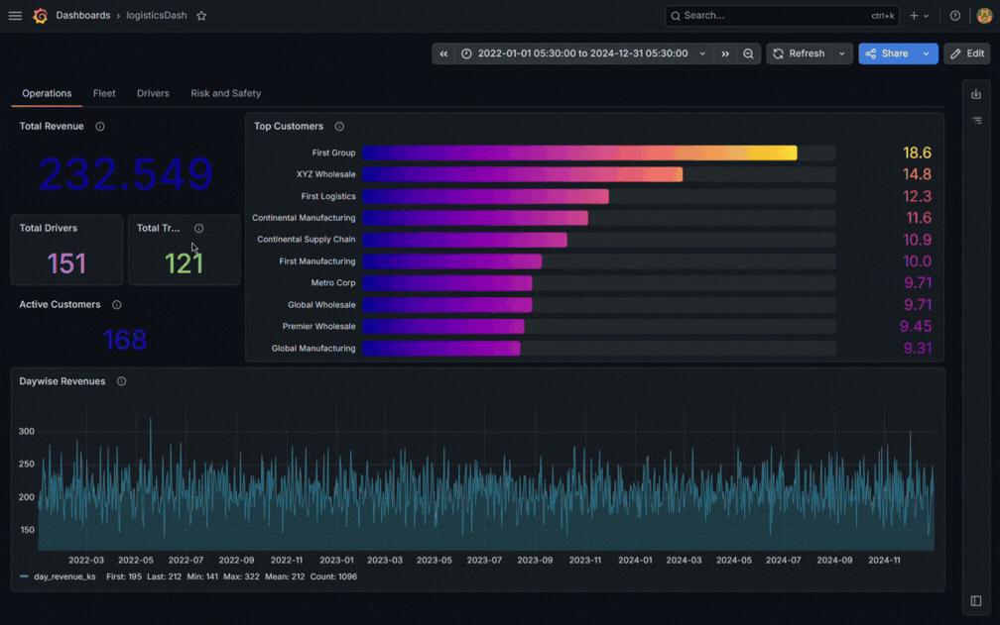

# Cloud Logistics Operations Analytics Platform
End-to-end logistics analytics platform using Amazon S3, AWS RDS PostgreSQL, SQL, Grafana to analyze fleet, driver and operational performance along with AWS SageMaker ML feasibility analysis.

### 1. Project Overview
This project develops a cloud-based logistics analytics platform that ingests logistics operations data from Amazon S3 into AWS RDS PostgreSQL, performs data validation and analytical transformations using SQL, and presents operational KPIs through Grafana dashboards. The platform is designed to support fleet, driver, customer, and maintenance performance analysis, with a machine-learning layer for predictive operational insights.

### 2. Business Targets
   - Monitor fleet utilization and performance
   - Analyze driver performance and safety
   - Analyze fuel and maintenance costs
   - Support predictive logistics analytics

### 3. Architecture



### 4. Architecture Components
#### I. Dataset
   The dataset is obtained from <a href="https://www.kaggle.com/datasets/yogape/logistics-operations-database?resource=download">kaggle</a>

Data includes: Drivers, Trucks, Customers, Routes, Loads, Trips, Fuel purchases, Maintenance, Delivery events, Safety incidents, Truck utilization



#### II. AWS S3 and RDS Ingestion
The dataset is ingested in the following order

CSV Files -> Amazon S3 Bucket -> IAM Role -> RDS S3 Integration -> PostgreSQL Staging Tables

#### III. SQL Analytics
This includes Data Quality check:
- Duplicate records
- Missing primary keys
- Null values

Utilizing SQL techniques such as:
- JOINS
- CTEs
- GROUP BY
- VIEWS
to generate data insights

#### IV. Business Insights
- Fleet : Fleet Utilization, Total Miles
- Drivers : Active Drivers, Trips per Driver
- Customers : Revenue, Contributions
- Safety : Incidents, Damages

### 5. Grafana Dashboards



## Machine Learning — Amazon SageMaker

The project includes a machine-learning feasibility assessment using **Amazon SageMaker** to evaluate whether the available logistics data could support delivery-delay prediction.

- Loaded the feature-engineered logistics dataset from Amazon S3 into a SageMaker environment
- Additional EDA and feature engineering confirmed minimal separation between delayed and non-delayed deliveries
- Evaluated Logistic Regression and Random Forest models for delivery-delay prediction
- ML model development was intentionally discontinued rather than overfitting or deploying an unreliable prediction model
- Detailed process are documented in the [`ml_feasibility_notebooks`](ml_feasibility_notebooks/) folder.

### ML Workflow

```text
Amazon S3
    │
    ▼
Feature-Engineered Dataset
    │
    ▼
Amazon SageMaker
    │
    ├── Data Preparation
    │      ├── Train / Validation Split
    │      ├── Missing Value Handling
    │      └── Categorical Encoding
    │
    ├── Logistic Regression
    │
    └── Random Forest
    │
    ▼
Model Evaluation
    ├── Accuracy + Precision + Recall + F1 Score + ROC-AUC
    ▼
ML Feasibility Assessment
```

### I would also add a small results table

```markdown
### Model Results

|    Model     |    Accuracy    |    Precision    |    Recall    |    F1    |    ROC-AUC    |
|    - - -     |     - - - :    |      - - - :    |    - - - :   | - - - :  |    - - - :    |
| Logistic Regr|      53.42%    |      55.35%     |    81.67%    |  65.98%  |      0.501    |
| Random Forest|      54.39%    |      55.33%     |    91.05%    |  68.83%  |      0.492    |

> **Conclusion:** ROC-AUC values close to 0.50 indicated that the available dataset did not contain sufficient predictive signal for reliable delivery-delay prediction. The ML component was therefore treated as a feasibility assessment rather than proceeding with model deployment.
```
